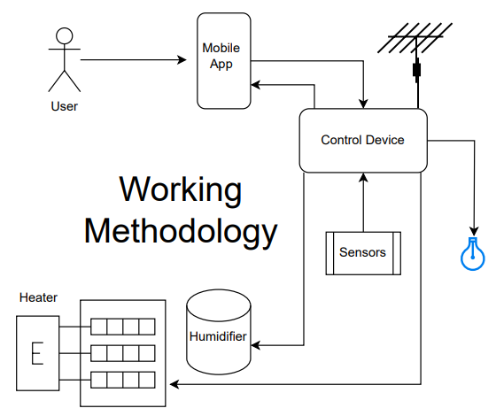
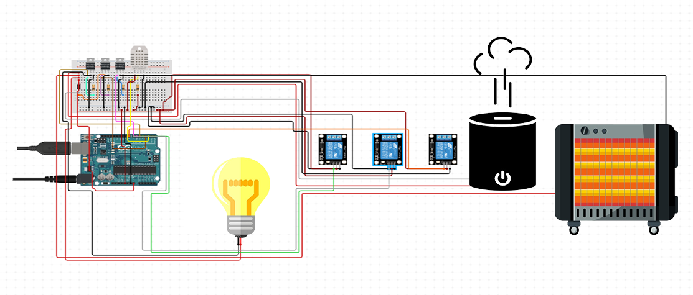
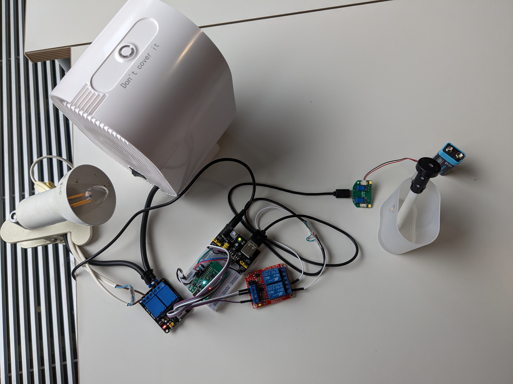
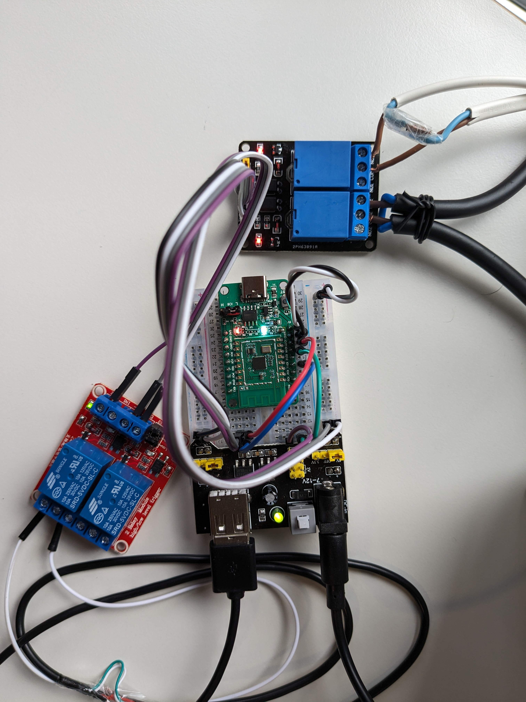
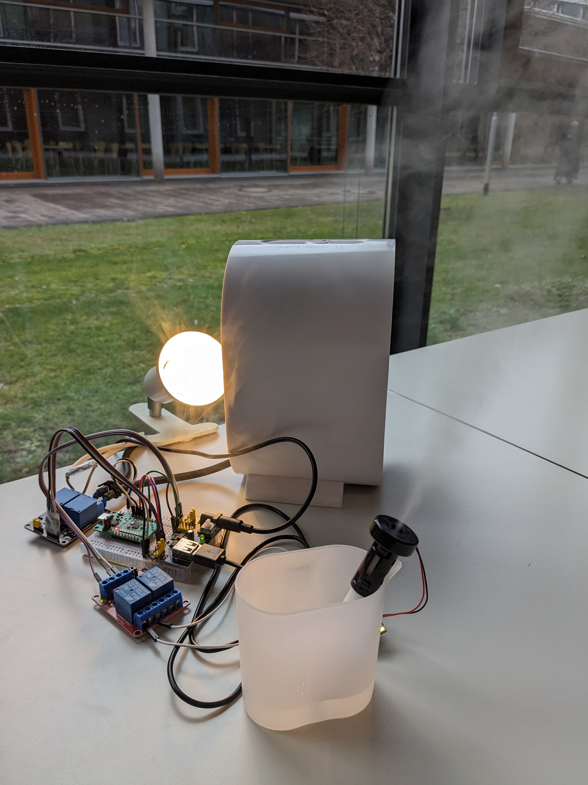
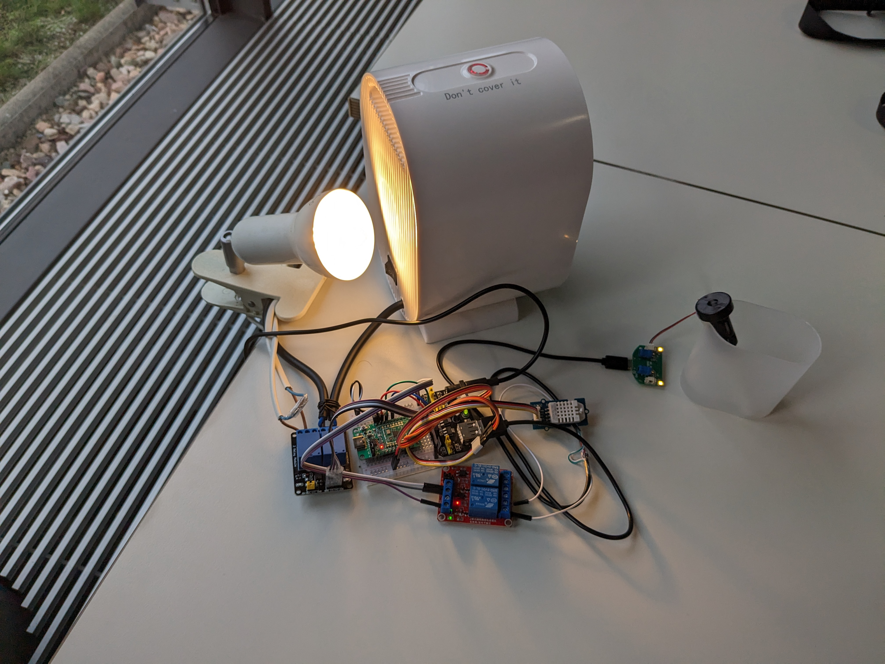
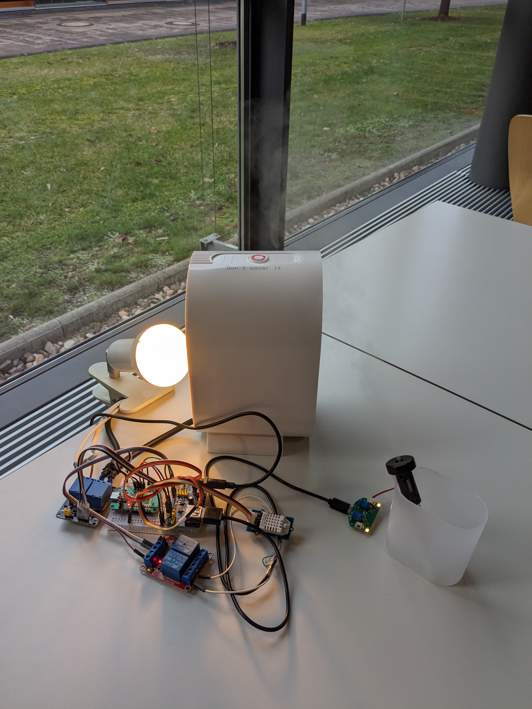
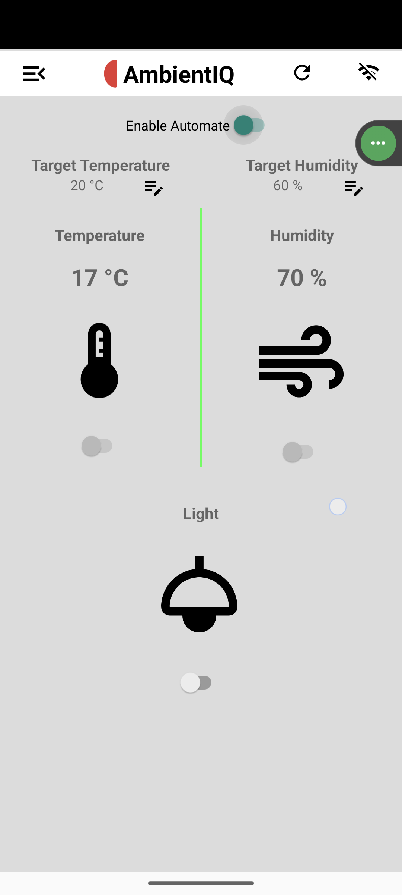

# [AmbientIQ: Smart Home Controller with Pinecorn](https://ambientiq.dorik.io/) 
 

AmbientIQ : A Sophisticated Smart Room Ecosystem for Ultimate Comfort and Efficiency. Our prototype addresses the critical role of indoor climate control in maintaining the well-being of individuals, particularly those vulnerable to health issues stemming from insufficient humidity and tempera- ture levels. At its core, our system features a DHT22 sensor, a micro-controller [Pinecone](https://wiki.pine64.org/wiki/PineCone#PineCone_BL602_EVB_information_and_schematics), relay switches, and wireless control options. The humidity sensor accurately monitors and controls humidity levels, while the temperature sensor finds the current temperature. In order to capture various signals from different sensors, the microcontroller [Pinecone](https://wiki.pine64.org/wiki/PineCone#PineCone_BL602_EVB_information_and_schematics), processes data and adjusts the heating device and humidifier according to user preferences. [Android](https://github.com/nazmos-sakib/AmbientIQ) application will be used as a user interaction point with the system, where users can set convenient temperature and humidity levels and monitor the temperature and humidity range. An Android app that is connected to a microcontroller via WiFi provides realtime information about current temperature and humidity levels. The app also enables users to make decisions about balancing settings for their comfort and health
    
Pinecone
=======
[PineCone](https://pine64.com/product/pinecone-bl602-evaluation-board/) BL602 Evaluation Board(EVB). It is based on the BL602 SoC and has a 32-bit RISC-V microprocessor, 276kB RAM and 128kB ROM.It is an open- source IoT development board with builtin USB to Serial, PCB antenna, and USB-C connection. It supports Bluetooth Low Energy 5.0 and 2.4 GHz Wi-Fi. Also it offers 2MB Flash for prototyping IoT projects and features onboard LEDs, enabling communication with the web application for real- time data visualization and notification delivery.

Methodology
=======
 The smart humidifier operates seamlessly to maintain a comfortable indoor environment. The DHT22 sensor continuously monitors the humidity and temperature in the surrounding environment. Through an Android app, users can define a parameter for temperature and humidity that the microcontroller constantly tries to maintain. When the microcontroller receives the DHT22 signal, it evaluates it with a predefined parameter, and if the signal value is below the predefined parameter, another signal will be sent from the microcontroller to the relay, which turns on the humidifier. Similarly, the heater will also be turned on when the temperature is below and turned off when the temperature rises above the predefined parameter. Users also have free control over the connected device. The user can manually turn off or turn on devices that are connected to the micro- controller through the Android app. Some other peripherals like Light can also be connected with the system. Any peripherals or IOT device can be directly manually controlled through the app. The app is connected to the via wifi. MCU is programmed to create a wifi access point with WPA2 security protocol. The data transfer between the app and MCU maintains TCP/IP protocol. Lightweight TCP/IP (lwIP) Stack[Lightweight] is a great tool for low energy efficient device. This create our MCU a light weight server and makes data Transfer possible between MCU and App.

Multitasking
=======
 
PineCone leverages the FreeRTOS operating system to run multiple tasks concurrently. This open-source, real-time, and lightweight OS is designed for resource-constrained devices and can seamlessly integrate into applications as a library. Since PineCone has a single core processor, the available CPU time must be distributed among tasks, necessitating the establishment of task priorities. Tasks that occur sooner or require more CPU time should be assigned higher priority. For instance, prioritizing user input tasks reduces lag and enhances the overall user ex- perience. 

The proposed system consists of three concurrent tasks: HTTPd task, Wi-Fi task and Sensor task. FreeR- TOS supports 32 priority levels, with 32 being the highest. The priority settings of HTTPd task, Wi-Fi task and Sensor task are set to 20, 26, and 32 respectively.

The HTTPd task, or Hypertext Transfer Protocol daemon, serves as an HTTP server implemented through lightweight IP(lwIP). lwIP is an implementa- tion of TCP/IP protocol suite for embedded systems. The HTTPd task hosts HTTP services that can be ac- cessed by the client. It then waits for the incoming client requests and for each request, it responds with the re- quested information. In the proposed system, the server exposes an HTTP endpoint through which the client can get the water level in JSON format.

PineCone supports three Wi-Fi modes: the station mode, the access point mode and the combined station- access point mode. In the proposed system, the Wi-Fi task configures PineCone to function as a Wi-Fi access point. A Service Set Identifier(SSID) is configured for the created hotpot, to uniquely identify the Wi-Fi net- work. To enhance security, a password is also configured for the access point otherwise, the hotspot operates as an open access point.

The sensor task is responsible for obtaining the DHT22 data. DHT22 sensor is privilesed with directely accessing the memory of the MCU directly via DMA. It is continiously writing its data to 40 bit allocated mamory. To read the data, simply reading the memory is sufficient.

Hardware Specifications and Technical Implementations
=======
In terms of meeting industrial, social, and economic demands, the system must be sustainable. The following design specifications are specified in table for this project in order to meet the criteria of the proposed solution and to increase system efficiency:

| Element Name | Model Number | Rating |
|----------|----------|----------|
| Pinecone | BL602 | 5v |
| CPU Architecture | RICS-V |  |
|Sensor|DHT22|In 5v, Out 0-3.5v|
|Relay|SRD-05VDC-SL-C|In 3.5-5v, Out 10A 125v AC, 10A 28v DC|
|Heater||220v AC|
|Light||220v AC|
|Humidifier||220v AC|
|Microcontroller   Development|Language|C Programming|
||SDK|Bouffalolab/BL602 SDK|
||Wireless Communication | WiFi/LwIP|
|App Development|Android|Android Studio/JAVA|

Circuit Diagram:
=======

The heart of our project is [Pinrcone](),   which is a BL602 evolution board. This board has multiple multipurpose digital or analog input/output GPIO pins. DHT22, which is an analog sensor, is directly connected to the MCU with an analog input GPIO pin. The pin is configured to have Direct Memory Access (DMA) there- fore, the sensor continuously writes its value directly to the memory. A task is running in parallel that is collecting the sensor data from the memory and con- verting it to human-readable format. 

The output peripherals (light, heater, and humidifier) are controlled through digital signals and are therefore connected to digital pins.

 
 
 

# Pins Configuration:

|Pinecone Bl-602|DHT22|Light Relay|Humidifigher Relay|Heater Relay|
|----------|----------|----------|----------|----------|
|GND|GND|GND|GND|GND|
|5V|VCC|VCC|VCC|VCC|
|IO4|S||||
|IO17||S|||
|IO14|||S||
|IO11||||S|

SDK Setup
=======
The proposed system utilizes a FreeRTOS-based IoT [SDK](https://github.com/pine64/bl_iot_sdk) provided by Bouffalo Labs. The project is created inside the customer_app subdirectory in the SDK.

Flashing Mode
=======
The [blflash](https://pine64.github.io/bl602-docs/Quickstart_Guide/Linux/Quickstart_Linux_ubuntu.html#flashing) tool, a BL602 serial flasher written in Rust14 is used for flashing. Before initiating the flash, the PineCone is connected to the laptop via a Type-C USB cable and set to flashing mode. This involves positioning the jumper on IO8 to cover IO8 and H(3.3V) and resetting the device using the reset button without repowering it. The firmware flashing process is executed through the “blflash flash” command in the terminal while mentioning the usb port. [./blflash-linux-amd64 flash sdk_app_helloworld.bin --port /dev/ttyUSB0]

Operating Mode
=======
To run the program, the jumper on IO8 is set to cover IO8 and L(0V) and the reset button is pressed. The Web Serial Terminal, a tool from Google Chrome Labs, is then utilized to read the serial output from the PineCone. It is opened in the Chrome browser with a
13 https://github.com/spacemeowx2/blflash/releases 14 https://www.rust- lang.org/
    
baud rate of 2000000 and connected to the same serial port used for flashing.

Android Application
=======
The [AmbientIQ](https://github.com/nazmos-sakib/AmbientIQ/tree/main) Android application has developed tat gives the user the power to monitor room temparature and humidity as well as controlling connected electronics devices.

# Project Preview

|  |   | |
| ---------------------------------------------- | -------------------------------------------- | ------------------------------------------- | 

|  |  |  |
| ------------------------------------------- | ------------------------------------------- | ------------------------------------------- |

## Youtube Video: [Watch how it works Video]

Results and Limitations
========
In our testing, it has been concluded that the sensor data that are being collected are not too precise and accurate. There is always a 1 or 2 °C temperature difference between the sensor reading and actual temperature.

